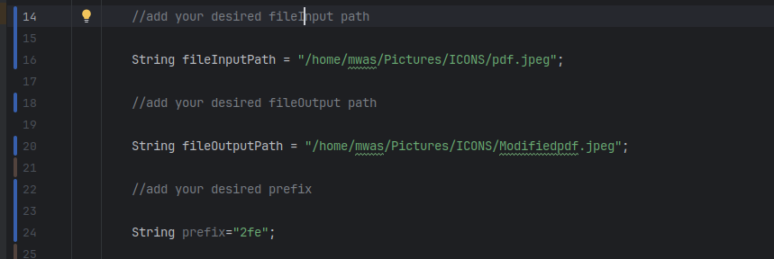

# Image Hash Spoofing Tool

## Overview

This tool modifies an image file such that its hash begins with a specified hex string (e.g., 0x24), while
preserving the image's visual appearance. The modification works by adjusting non-visual data within the image file (
e.g., padding, metadata), ensuring the image appears unchanged when opened in image viewers.

## Objective

The goal of this tool is to adjust an image file (e.g., a JPEG) so that its SHA-512 hash begins with a specific prefix,
while maintaining the image’s visual appearance. The tool performs this modification by adding or adjusting non-visual
data in the file without altering the actual image content.

## Key Concepts

### Image File Structure:

- **Image Header**: Contains metadata like the file format, compression type, and other necessary information for
  rendering the image.
- **Image Data**: The pixel data that represents the visual content of the image.
- **Padding or Metadata**: Non-visual elements of the image file that can be modified without affecting the display of
  the image (e.g., metadata, padding bytes).

### Working file-formats:

- **png**
- **jpeg/jpg**
- **giff**
- **tiff**

### Hashing:

- A cryptographic hash function that generates a fixed-length hash from input data. The goal is to
  manipulate the image file so that its SHA-512 hash starts with a given string (e.g., 0x22).
- **File Integrity**: The image must appear unchanged when opened in image viewers, so the modification must not alter
  the image's display.

## Working hash Algorithms

- **SHA-1**
- **SHA-256**
- **SHA-512**
- **SHA-512/244**
- **SHA-512/256**
- **SHA-384**
- **SHA-244**

## Approach

### Step 1: Reading and Hashing the Original Image

- Compute the SHA-512 hash of the original image to serve as the baseline for comparison.

### Step 2: Manipulating the Image File

- **Padding**: Adjust bytes at the end of the file or in non-image sections (e.g., metadata).
- **Non-Image Data**: Modify the file's structure without changing the image’s visual data.

### Step 3: Checking the Hash

- After modifying the file, compute the new SHA-512 hash or the SHA algorithm and check if it matches the desired
  prefix (e.g., 0x24).

### Step 4: Writing the Modified File

- Once the file's hash matches the target prefix, save the modified image under a new name (e.g., `altered.jpg`).

## Design Decisions

### Padding Strategy:

- **Why Padding?**Typically, padding is done at the end of the structure to fill it up with data, with the padding
  usually
  consisting of 1 bits, blank characters or null characters , ensuring no visual change ie the file is identical to the
  human eye when opened in image viewers .
- **Non-Destructive () doesnt modify image pixel**: Padding doesn't modify the pixel data, making it safe,best for the
  task
- and achieving the desired hash condition.
- **Efficiency**: Padding is a straightforward method but it may require several iterations to achieve the correct
  hash.

### Iteration and Time Complexity:

- **Multiple Iterations**: Achieving the desired hash prefix may require several iterations, depending on the image size
  and the number of adjustments needed.
- **Performance Considerations**: Processing large images may take more time, especially with multiple iterations so as to 
  get the desired hash.

### Hashing Algorithm:

- **SHA-512**: Chosen for its long and complex hash value, making it suitable for achieving a hash with a specific
  prefix.
- **Other Hashing Methods**: Other algorithms, like SHA-256,SHA-1,SHA-512/244,SHA-512/256,SHA-384,SHA-244 could also be
  used, depending on the required prefix length.

## Limitations

1. **Image Format**:The tool assumes that the image format supports manipulation via padding or metadata adjustments.
   Formats like JPEG, PNG, GIF, and TIFF can handle non-visual data differently, while vector-based formats like SVG may
   not support the same types of manipulations.
2. **File Size and Performance**: Larger images might take longer to process due to the number of iterations required to
   find the correct hash.
3. **Exact Matching**: The tool does not guarantee an exact match for all target prefixes in a finite amount of time due
   to the iterative nature of the process.

## Prerequisites

Before running the program, ensure you have the following: - **JDK 8 or higher** installed. - **Basic knowledge of file paths** in your operating system. ---

## File Structure

```plaintext
├── ImageSpoofingInterface.java      // Interface for the spoofing service
├── ImageSpoofingService.java        // Service that implements the spoofing logic
├── Main.java                        // Main class to run the program
```
## Key Functions

### `bytesToHex(byte[] bytes)`
- Converts a byte array into a hexadecimal string.
### `hashEngine(byte[] hex)`
- Computes the SHA-256 hash of the file's byte array. - Uses Java's `MessageDigest` library for
  cryptographic hashing.
### `padding(byte[] imageBytes, String fileOutputPath)`
- Repeatedly appends a padding byte (e.g., 0x2FE) to the image byte array until a condition is met. -
  Saves the modified byte array to a file (e.g., `ModifiedFile.jpeg`). - Computes the hash of the
  modified byte array after each iteration. - Logs:
    - The hash when the condition is meet.
    - The number of iterations taken.
    - The time required to find
      the match.

## Loggings

- Each computed byte array and its hash.
- The number of iterations performed until the conditions are meet.
- Total time taken to achieve the desired hash conditions ie start with the prefix.
  

## Modify Parameters

- Update the fileInputPath and fileOutputPath variables in the Main class to specify your desired input file & output file location .
- Adjust the condition ie update the prefix  to meet desired requirements.
  

## NB: NOTES

- Ensure:
    - File inputfile exist and the fileinputpath is correct.
    - Ensure the outputFilepath has write permissions.
